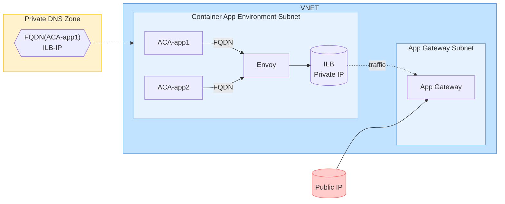

# AIExamples-8-24-Streamlit
AIExamples-8-24-Streamlit

```mermaid
graph LR
    subgraph VNET["VNET"]
        subgraph ContainerAppEnv["Container App Environment Subnet"]
            ACA1[ACA-app1]
            ACA2[ACA-app2]
            Envoy
            ILB[("ILB\nPrivate IP")]
            ACA1 --> |FQDN| Envoy
            ACA2 --> |FQDN| Envoy
            Envoy --> ILB
        end
        subgraph AppGatewaySubnet["App Gateway Subnet"]
            AppGateway["App Gateway"]
        end
        ILB -.-> |traffic| AppGateway
    end
    PublicIP[("Public IP")] --> AppGateway
    
    subgraph PrivateDNSZone["Private DNS Zone"]
        DNS{{"FQDN(ACA-app1)\nILB-IP"}}
    end
    DNS -.-> ContainerAppEnv

    classDef subnet fill:#e6f3ff,stroke:#6ca9e6;
    class ContainerAppEnv,AppGatewaySubnet subnet;
    
    classDef vnet fill:#c1e3ff,stroke:#4a90e2;
    class VNET vnet;
    
    classDef publicIP fill:#ffcccb,stroke:#ff6b6b;
    class PublicIP publicIP;
    
    classDef dnsZone fill:#fff2cc,stroke:#ffcd28;
    class PrivateDNSZone dnsZone;
```
