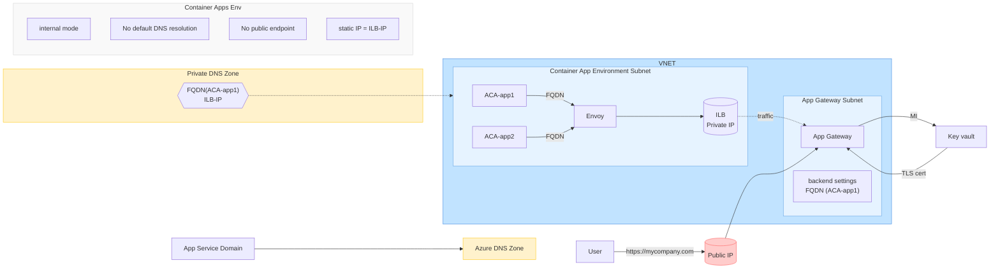
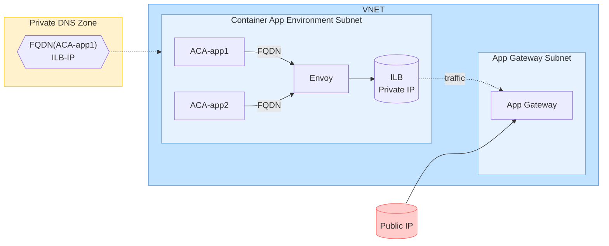

# AIExamples-8-24-Streamlit
AIExamples-8-24-Streamlit

# Deploy as Web App on AZ:

## Startup Command:
Python 3.11
pip3 install -r requirements.txt  |  python -m streamlit run app.py --server.port 8000 --server.address 0.0.0.0

## Platform settings:
SCM off
FTP off
SSH on
Always On on
HTTPS only on
Remote debug off
Cert ignore

## Custom domains
20.119.8.32 ip
Custom domains:  ai-01.azurewebsites.net

## Network
Inbound traffic config
Public: Enabled no restrict
Inbound address

# Detailed VNET for ACA

# Simple VNET for ACA

