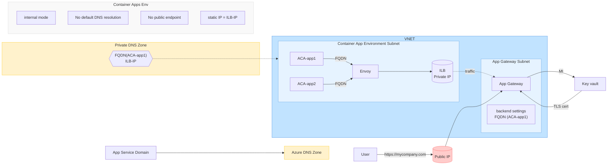
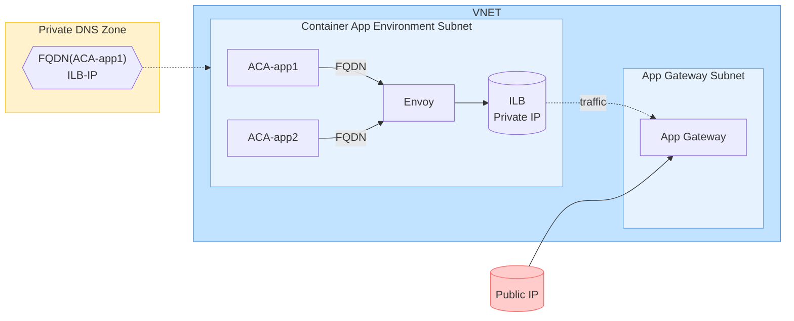

# AIExamples-8-24-Streamlit
AIExamples-8-24-Streamlit

# VSCode Extensions
1. Azure Resources
2. Azure Account
3. Azure App Services
4. Azure CLI Tools
5. Azure Functions
6. Azure Resource Manager Snippets
7. Azure Resource Manager Tools

# Use Latest VSCode Insiders - 1.93 system

# Use Latest Python - 3.12.5 using In VSCode Ctrl-Shift-P for Select: Python Interpreter
If using torch use 3.11 as 3.12 is not supported yet.
Notice the path with ~AppData - this means that if username in Windows is aaron it would be installed in user's windows apps.  For me this path is the path to the 3.12.exe file to run py 3.12.5:  C:\Users\aaron\AppData\Local\Microsoft\WindowsApps
This also means that with a launch.json file used to debug that we will run python from there and also refer to our Scripts directory when examining install of requirements.txt libraries.

https://apps.microsoft.com/detail/9ncvdn91xzqp?hl=en-US&gl=US

# Install requirements.txt.

One thing you will notice is now MS has secured the python executables in a place where scripts and pip installs will be read only and thus they will install to your user directory:

PS C:\Users\aaron\Desktop\AIExamples\AIExamples-8-24-Streamlit> pip install -r requirements.txt
Defaulting to user installation because normal site-packages is not writeable

For my local debug install for latest VSCode this is in:
c:\users\aaron\appdata\local\packages\pythonsoftwarefoundation.python.3.12_qbz5n2kfra8p0\localcache\local-packages\python312\site-packages

This unique ID also matches this directory:
C:\Users\aaron\AppData\Local\Microsoft\WindowsApps\PythonSoftwareFoundation.Python.3.12_qbz5n2kfra8p0 which is where the launched version will reside.

# Deploy as Web App on AZ:

## Startup Command:
Python 3.11
pip3 install -r requirements.txt  |  python -m streamlit run app.py --server.port 8000 --server.address 0.0.0.0

## Platform settings:
SCM off
FTP off
SSH on
Always On on
HTTPS only on
Remote debug off
Cert ignore

## Custom domains
20.119.8.32 ip
Custom domains:  ai-01.azurewebsites.net

## Network
Inbound traffic config
Public: Enabled no restrict
Inbound address

# Detailed VNET for ACA

# Simple VNET for ACA

