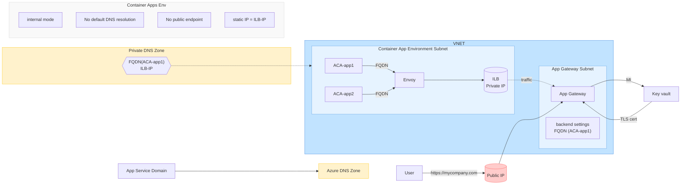
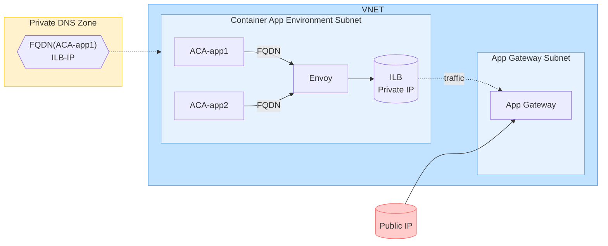

# Data Science and Data Engineering with AI, Azure, Python and Streamlit

# 1.Q; What are the top 3 data science and data engineering uses of AI?

# 1.A; Three top uses of AI in data science and data engineering:

1. Automated **feature** engineering and selection: AI can **analyze** large datasets to automatically **identify** relevant features and **create** new derived features, saving data scientists significant **time** and potentially uncovering **insights** humans might miss.

3. Anomaly **detection** and **predictive** maintenance: AI models can detect unusual **patterns** in data streams from sensors or systems, allowing for early identification of potential issues or failures in industrial equipment, networks, or other complex systems.

4. Natural language processing for **unstructured** data: AI enables the extraction of **insights** from vast amounts of unstructured text data (like customer reviews, social media posts, or support tickets) through techniques like **sentiment analysis**, **topic modeling**, and **named entity recognition**.

# 2.Q; Elaborate on each use case and then create a Streamlit application that demonstrates aspects of all three.

# 2.A;

1. Automated **feature engineering** and selection:

This process involves using **machine learning algorithms** to automatically create, transform, and select the **most relevant features** from a dataset. It can include techniques like:

#### -Principal Component Analysis (PCA) for dimensionality reduction
#### -Polynomial feature creation
#### -Encoding categorical variables
#### -Feature importance ranking using methods like Random Forest or Gradient Boosting


2. Anomaly detection and predictive maintenance:
This involves using statistical and machine learning methods to identify unusual patterns in data. Key aspects include:

#### -Establishing a baseline of "normal" behavior
#### -Using algorithms like Isolation Forests, One-Class SVM, or autoencoders to detect outliers
#### -Time series analysis to predict future anomalies or system failures
#### -Integration with IoT sensors for real-time monitoring

3. Natural Language Processing for unstructured data:
This encompasses a wide range of techniques to extract meaning from text data. Key components include:

#### -Text preprocessing (tokenization, stemming, lemmatization)
#### -Sentiment analysis to determine emotional tone
#### -Topic modeling to categorize documents or extract themes
#### -Named Entity Recognition to identify and classify named entities (e.g., persons, organizations, locations)

# Streamlit app for questions and answers:
## app.py
```python
import streamlit as st
import pandas as pd
import numpy as np
from sklearn.feature_selection import SelectKBest, f_classif
from sklearn.preprocessing import StandardScaler
from sklearn.ensemble import IsolationForest
from sklearn.decomposition import PCA
import nltk
from nltk.sentiment import SentimentIntensityAnalyzer
from nltk.tokenize import word_tokenize
from nltk.corpus import stopwords
from collections import Counter
import matplotlib.pyplot as plt

# Download necessary NLTK data
nltk.download('vader_lexicon')
nltk.download('punkt')
nltk.download('stopwords')

def main():
    st.title("AI in Data Science Demo")

    # Sidebar for navigation
    page = st.sidebar.selectbox("Choose a demo", ["Feature Engineering", "Anomaly Detection", "NLP Analysis"])

    if page == "Feature Engineering":
        feature_engineering_demo()
    elif page == "Anomaly Detection":
        anomaly_detection_demo()
    else:
        nlp_demo()

def feature_engineering_demo():
    st.header("Automated Feature Engineering and Selection")

    # Generate sample data
    X = np.random.rand(100, 5)
    y = np.random.randint(0, 2, 100)

    # Feature selection
    selector = SelectKBest(f_classif, k=3)
    X_new = selector.fit_transform(X, y)

    # PCA
    scaler = StandardScaler()
    X_scaled = scaler.fit_transform(X)
    pca = PCA(n_components=2)
    X_pca = pca.fit_transform(X_scaled)

    # Display results
    st.subheader("Original Features")
    st.write(pd.DataFrame(X, columns=[f"Feature {i+1}" for i in range(5)]).head())

    st.subheader("Selected Top 3 Features")
    st.write(pd.DataFrame(X_new, columns=[f"Selected Feature {i+1}" for i in range(3)]).head())

    st.subheader("PCA Transformation")
    st.write(pd.DataFrame(X_pca, columns=["PC1", "PC2"]).head())

    # Visualization
    fig, ax = plt.subplots()
    ax.scatter(X_pca[:, 0], X_pca[:, 1], c=y)
    ax.set_xlabel("First Principal Component")
    ax.set_ylabel("Second Principal Component")
    ax.set_title("PCA of Dataset")
    st.pyplot(fig)

def anomaly_detection_demo():
    st.header("Anomaly Detection")

    # Generate sample data with anomalies
    np.random.seed(42)
    X = np.random.randn(100, 2)
    X[-5:] = X[-5:] + [4, 4]  # Add some anomalies

    # Fit Isolation Forest
    clf = IsolationForest(contamination=0.1, random_state=42)
    y_pred = clf.fit_predict(X)

    # Visualization
    fig, ax = plt.subplots()
    ax.scatter(X[:, 0], X[:, 1], c=y_pred, cmap='viridis')
    ax.set_title("Anomaly Detection using Isolation Forest")
    ax.set_xlabel("Feature 1")
    ax.set_ylabel("Feature 2")
    st.pyplot(fig)

    st.write("Points in yellow are detected as anomalies.")

def nlp_demo():
    st.header("NLP Analysis")

    # Sample text input
    text = st.text_area("Enter text for analysis", "I love using AI for data analysis. It's exciting and powerful!")

    if text:
        # Sentiment Analysis
        sia = SentimentIntensityAnalyzer()
        sentiment = sia.polarity_scores(text)

        st.subheader("Sentiment Analysis")
        st.write(f"Positive: {sentiment['pos']:.2f}")
        st.write(f"Neutral: {sentiment['neu']:.2f}")
        st.write(f"Negative: {sentiment['neg']:.2f}")

        # Simple keyword extraction
        tokens = word_tokenize(text.lower())
        stop_words = set(stopwords.words('english'))
        keywords = [word for word in tokens if word.isalnum() and word not in stop_words]
        keyword_freq = Counter(keywords).most_common(5)

        st.subheader("Top Keywords")
        st.write(pd.DataFrame(keyword_freq, columns=["Keyword", "Frequency"]))

if __name__ == "__main__":
    main()
```
## requirements.txt
```markdown
streamlit==1.22.0
pandas==1.5.3
numpy==1.24.3
scikit-learn==1.2.2
nltk==3.8.1
matplotlib==3.7.1
```

# Mentorship - How we can support eachother to improve our impact on customer pains.

1. Group up - we are stronger together than we are alone.
2. Support and mentor each day with the useful things you learn.  Each person has unique specialties, discoveries and knowledge which augment your knowledge..
3. Solve for performance and fairness through listening, empathy and understanding with collaboration through peer review.
4. Build knowledge across larger teams since mass and agency spread good news.  We make things easier for eachother because we can.
5. Appeal to and pursue decreasing pains and needs.  This increases scale of payout when we work together as a Team, Division, Organization, Corporation, Country and Humanity.
6. Take time to listen and understand.  Knowing and say aloud often names of people you encounter to share in the joy of supporting, coaching and mentoring to be our best.
7. Sacrifice pride and confusion by focusing on mind, body, knowledge, improvement, hard thoughtful work, and the speed of passing what you learn on to others.
8. Continually reach out and help others in pain.  What we do for eachother creates joy and superpowers where doubt will fail and resilience wins.
9. Take care of mind and body to replace difficulty, and discouragement with quiet confidence and preparedness.
10. Overcome fear and be curious, asking for help when you need it.  Always assist others in need.
11. Practice truth through careful study, fact checking and humor.  Be genuine and give time to others using careful attention on what changes motives and attitudes.
12. Control and focus desire to help one another.  Be your best supportive self to those around you.

# How we can improve our AI Practice and Methodology

#### 1. 🤝 Collaborative AI Evaluation Frameworks
• Standardized metrics across institutions
• Shared results for best practices
• Focus on privacy, accuracy, and efficiency

#### 2. 🔒 Privacy-Preserving Federated Learning Networks
• Distributed training without data sharing
• Cost-benefit analysis of implementation
• Balance performance gains vs. privacy protection

#### 3. 🧭 AI Ethics Mentorship Programs
• Pair experienced ethicists with developers
• Guide bias and fairness studies
• Quantify costs of biased systems vs. benefits

#### 4. 👥 Multi-stakeholder Value Assessment Workshops
• Include AI scientists, providers, patients, administrators
• Define and prioritize value metrics
• Holistic understanding of AI impact

#### 5. 📊 Longitudinal AI Impact Studies
• Track outcomes, burnout, efficiency over years
• Assess evolving value proposition
• Inform future development strategies

#### 6. 🏅 AI Transparency Scorecards
• Standardize transparency metrics
• Correlate with trust, adoption, outcomes
• Analyze cost-benefit of explainability investments

#### 7. 🛡️ Cross-disciplinary AI Safety Teams
• Combine ML, cybersecurity, privacy expertise
• Comprehensive risk assessments
• Quantify potential costs vs. benefits

#### 8. 📘 Adaptive AI Governance Frameworks
• Regular reassessments of performance and compliance
• Clear update processes for policies and requirements
• Evolve based on ongoing cost-benefit analyses

#### 9. 🤖👤 AI-Human Collaboration Optimization Studies
• Analyze different human-AI interaction models
• Use time-motion studies and satisfaction surveys
• Quantify costs and benefits of collaboration designs

#### 10. 🩺 Patient-Centric AI Value Assessments
• Direct patient perspective on AI systems
• Focus groups, surveys, patient-reported outcomes
• Balance perceived benefits vs. privacy concerns

# VSCode Extensions for Azure
1. Azure Resources
2. Azure Account
3. Azure App Services
4. Azure CLI Tools
5. Azure Functions
6. Azure Resource Manager Snippets
7. Azure Resource Manager Tools

# Test Using Latest VSCode Insiders - 1.93 system - Why?  


# Use Latest Python - 3.12.5 using In VSCode Ctrl-Shift-P for Select: Python Interpreter
If using torch use 3.11 as 3.12 is not supported yet.
Notice the path with ~AppData - this means that if username in Windows is aaron it would be installed in user's windows apps.  For me this path is the path to the 3.12.exe file to run py 3.12.5:  C:\Users\aaron\AppData\Local\Microsoft\WindowsApps
This also means that with a launch.json file used to debug that we will run python from there and also refer to our Scripts directory when examining install of requirements.txt libraries.


https://apps.microsoft.com/detail/9ncvdn91xzqp?hl=en-US&gl=US

# Install requirements.txt.

One thing you will notice is now MS has secured the python executables in a place where scripts and pip installs will be read only and thus they will install to your user directory:

PS C:\Users\aaron\Desktop\AIExamples\AIExamples-8-24-Streamlit> pip install -r requirements.txt
Defaulting to user installation because normal site-packages is not writeable

For my local debug install for latest VSCode this is in:
c:\users\aaron\appdata\local\packages\pythonsoftwarefoundation.python.3.12_qbz5n2kfra8p0\localcache\local-packages\python312\site-packages

This unique ID also matches this directory:
C:\Users\aaron\AppData\Local\Microsoft\WindowsApps\PythonSoftwareFoundation.Python.3.12_qbz5n2kfra8p0 which is where the launched version will reside.

Using the command line shell you will also notice that this scripts directory is not on your path.  Add it to your path to ensure that when executables from pypi packages for your user account are shelled from the correct location:

 WARNING: The script watchmedo.exe is installed in 'C:\Users\aaron\AppData\Local\Packages\PythonSoftwareFoundation.Python.3.12_qbz5n2kfra8p0\LocalCache\local-packages\Python312\Scripts' which is not on PATH.
  Consider adding this directory to PATH or, if you prefer to suppress this warning, use --no-warn-script-location. 

If you navigate in Windows to Desktop then to your machine name, then open properties panel you can modify the path:


Add the two lines to your path at the top so performance from command line finds 3.12.5 easily along with any pip installed requirements.


After adding that and rerun of pip install -r requirements.txt you will see the warnings do not appear but launch.json still is unaware of where to find streamlit.exe

Assist by adding this same to your path inside launch.json.

.vscode/launch.json should now your path to streamlit:

{
    "version": "0.2.0",
    "configurations": [
        {
            "name": "Streamlit: Run app.py",
            "type": "debugpy",
            "request": "launch",
            "program": "C:\Users\aaron\AppData\Local\Packages\PythonSoftwareFoundation.Python.3.12_qbz5n2kfra8p0\LocalCache\local-packages\Python312\Scripts\streamlit.exe",
            "args": [
                "run",
                "app.py"
            ],
            "console": "integratedTerminal"
        }
    ]
}


# Deploy as Web App on AZ:

## Startup Command:
Python 3.11
pip3 install -r requirements.txt  |  python -m streamlit run app.py --server.port 8000 --server.address 0.0.0.0

## Platform settings:
SCM off
FTP off
SSH on
Always On on
HTTPS only on
Remote debug off
Cert ignore

## Custom domains
20.119.8.32 ip
Custom domains:  ai-01.azurewebsites.net

## Network
Inbound traffic config
Public: Enabled no restrict
Inbound address

# Detailed VNET for ACA




# Simple VNET for ACA

